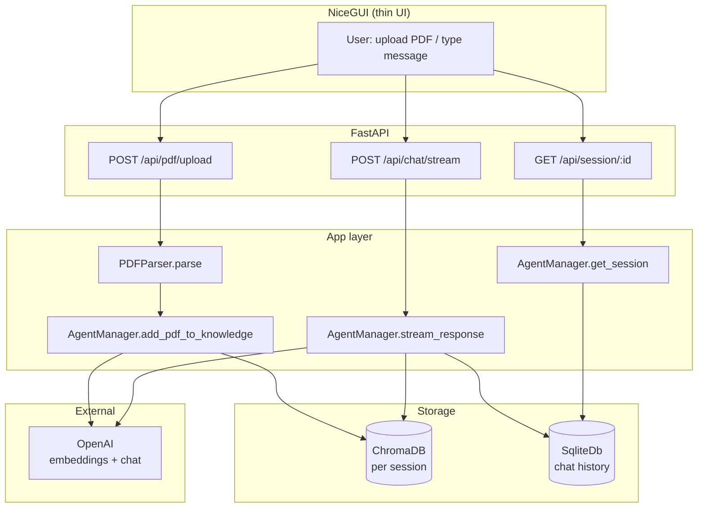
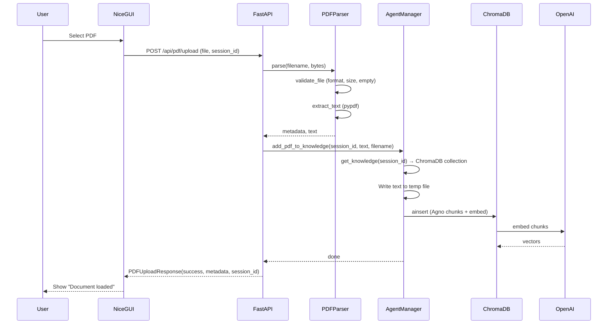
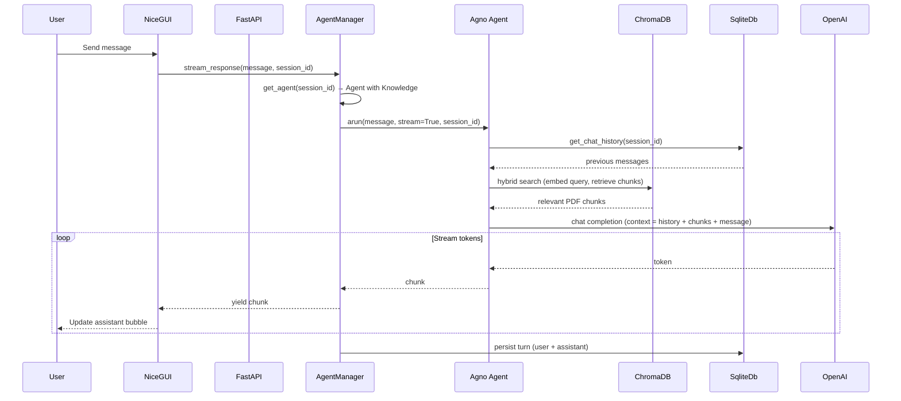
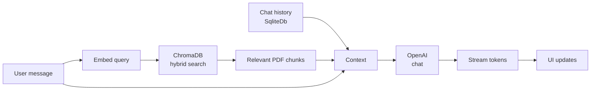

# PDF QA Chatbot — Architecture Diagram

## High-level flow



## PDF upload flow



## Chat / streaming flow (RAG)



## Component diagram

```mermaid
flowchart LR
    subgraph Frontend
        UI[NiceGUI\n/ page]
    end

    subgraph Backend["FastAPI (main.py)"]
        R1[/api/chat/stream]
        R2[/api/pdf/upload]
        R3[/api/session/:id]
    end

    subgraph Core
        P[PDFParser\nvalidate → extract → metadata]
        AM[AgentManager\nsession + agent + knowledge]
    end

    subgraph Agno
        Agent[Agent\nOpenAIChat]
        KB[Knowledge\nChromaDB]
        DB[SqliteDb\nhistory]
    end

    subgraph Data
        Chroma[(ChromaDB\nvectors)]
        SQL[(agent.db)]
    end

    UI <--> R1
    UI <--> R2
    UI <--> R3
    R1 --> AM
    R2 --> P
    R2 --> AM
    R3 --> AM
    P --> AM
    AM --> Agent
    AM --> KB
    Agent --> KB
    Agent --> DB
    KB --> Chroma
    DB --> SQL
```

## Data flow (RAG at answer time)


